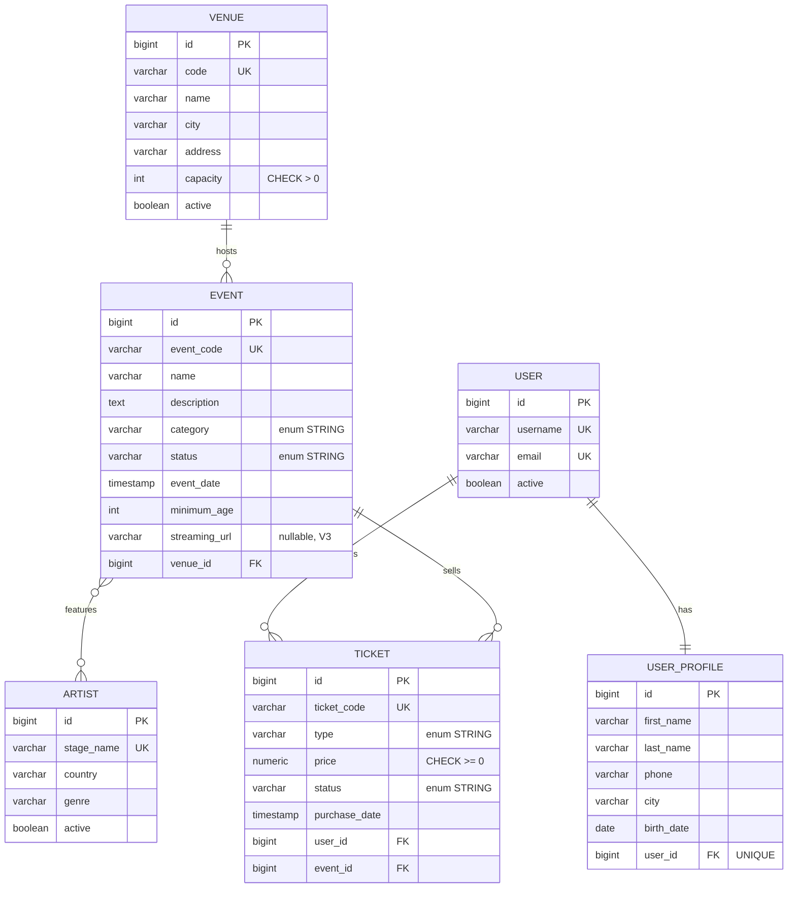

# PulsePass — Capa de persistencia (MVP académico)

Plataforma de **eventos, artistas y entradas**. Este repositorio implementa el núcleo de datos descrito en el PRD de PulsePass: modelo relacional en PostgreSQL, migraciones versionadas con Flyway, entidades JPA, repositories Spring Data y pruebas de integración contra PostgreSQL real con Testcontainers.


---

## Tabla de contenidos

1. [Stack tecnológico](#1-stack-tecnológico)
2. [Estructura del proyecto](#2-estructura-del-proyecto)
3. [Modelo de dominio](#3-modelo-de-dominio)
4. [Esquema relacional e integridad](#4-esquema-relacional-e-integridad)
5. [Migraciones Flyway](#5-migraciones-flyway)
6. [Consultas y repositories](#6-consultas-y-repositories)
7. [Ejecución de pruebas](#7-ejecución-de-pruebas)
8. [Ejecución local de la aplicación](#8-ejecución-local-de-la-aplicación)
9. [Decisiones de diseño](#9-decisiones-de-diseño)
10. [Trazabilidad con el PRD](#10-trazabilidad-con-el-prd)

---

## 1. Stack tecnológico

| Componente | Tecnología |
|---|---|
| Lenguaje | Java 21 |
| Framework | Spring Boot 4.1.1 (Spring Data JPA / Hibernate) |
| Base de datos | PostgreSQL |
| Migraciones | Flyway (`spring-boot-starter-flyway` + `flyway-database-postgresql`) |
| Pruebas | JUnit 5, AssertJ, Spring Boot Test, Testcontainers (PostgreSQL) |
| Build | Maven (wrapper incluido: `mvnw` / `mvnw.cmd`) |

Restricciones del caso académico que se respetan: no se usa H2, no se usa SQL nativo, no se usa Lombok, y `spring.jpa.hibernate.ddl-auto=validate` (Flyway es el único responsable del esquema).

---

## 2. Estructura del proyecto

```
PulsePass/
├── pom.xml
├── mvnw / mvnw.cmd
└── src/
    ├── main/
    │   ├── java/com/pulse/pass/
    │   │   ├── PulsePassApplication.java
    │   │   ├── domain/          # Entidades JPA y enums
    │   │   │   ├── Venue, Event, Artist, User, UserProfile, Ticket
    │   │   │   └── EventCategory, EventStatus, TicketType, TicketStatus
    │   │   └── repository/      # Interfaces Spring Data JPA
    │   │       ├── VenueRepository, EventRepository, ArtistRepository
    │   │       └── UserRepository, UserProfileRepository, TicketRepository
    │   └── resources/
    │       ├── application.yaml
    │       └── db/migration/    # V1, V2, V3 (Flyway)
    └── test/
        └── java/com/pulse/pass/
            ├── TestcontainersConfiguration.java
            ├── PulsePassApplicationTests.java
            └── repository/      # Pruebas de integración de repositories
```

---

## 3. Modelo de dominio



### Relaciones y su mapeo JPA

| Relación | Mapeo | Notas |
|---|---|---|
| Venue 1 : N Event | `Event.venue` `@ManyToOne(LAZY)` ↔ `Venue.events` `@OneToMany(mappedBy)` | `venue_id` es `NOT NULL` |
| Event N : M Artist | `Event.artists` (lado propietario, `@JoinTable event_artists`) ↔ `Artist.events` (`mappedBy`) | Tabla puente con PK compuesta |
| User 1 : 1 UserProfile | `UserProfile.user` (lado propietario, `unique = true`) ↔ `User.profile` (`mappedBy`) | La FK `user_id` es `UNIQUE` |
| User 1 : N Ticket | `Ticket.user` `@ManyToOne(LAZY, optional = false)` | |
| Event 1 : N Ticket | `Ticket.event` `@ManyToOne(LAZY, optional = false)` | |

### Enums

Todos se persisten con `@Enumerated(EnumType.STRING)` (nunca por ordinal) y además están protegidos por un `CHECK` en la base de datos.

| Enum | Valores |
|---|---|
| `EventCategory` | MUSIC, SPORTS, TECHNOLOGY, EDUCATION, CULTURE, ENTERTAINMENT |
| `EventStatus` | DRAFT, PUBLISHED, SOLD_OUT, CANCELLED, FINISHED |
| `TicketType` | GENERAL, VIP, BACKSTAGE, STUDENT |
| `TicketStatus` | RESERVED, PAID, CANCELLED, USED |

---

## 4. Esquema relacional e integridad

Siete tablas: `venues`, `events`, `artists`, `event_artists`, `users`, `user_profiles`, `tickets`.

| Campo / relación | Regla en PostgreSQL |
|---|---|
| `venues.code` | `UNIQUE NOT NULL` |
| `venues.capacity` | `CHECK (capacity > 0)` |
| `events.event_code` | `UNIQUE NOT NULL` |
| `events.category`, `events.status` | `CHECK (... IN (...))` con los valores del enum |
| `events.venue_id` | FK `NOT NULL` → `venues(id)` |
| `artists.stage_name` | `UNIQUE NOT NULL` |
| `users.username`, `users.email` | `UNIQUE NOT NULL` |
| `user_profiles.user_id` | FK + `UNIQUE` (garantiza 1:1) |
| `tickets.ticket_code` | `UNIQUE NOT NULL` |
| `tickets.price` | `NUMERIC(12,2)` + `CHECK (price >= 0)` |
| `tickets.type`, `tickets.status` | `CHECK (... IN (...))` con los valores del enum |
| `tickets.user_id`, `tickets.event_id` | FK `NOT NULL` |
| `event_artists` | `PRIMARY KEY (event_id, artist_id)` |

Índices creados en V1: `events(venue_id)`, `events(status, event_date)`, `event_artists(artist_id)`, `tickets(user_id)`, `tickets(event_id, status)`.

---

## 5. Migraciones Flyway

Ubicación: `src/main/resources/db/migration/`. Se aplican en orden sobre una base vacía.

| Migración | Objetivo |
|---|---|
| `V1__create_schema.sql` | Crea las 7 tablas con PK, FK, UNIQUE, CHECK e índices. |
| `V2__insert_initial.artists.sql` | Inserta el catálogo inicial: Solar Beat, Neon Waves, Caribbean Sound, Ocean Drive y Digital Pulse. |
| `V3__add_streaming_url_to_event.sql` | Agrega `streaming_url VARCHAR(500)` (nullable) a `events`, sin modificar V1. |

**Regla de oro:** una migración ya aplicada nunca se edita. Cualquier cambio estructural nuevo va en un `V4__...`, `V5__...`, etc. Editar V1 en un entorno compartido rompería la validación de checksums de Flyway.

---

## 6. Consultas y repositories

Todos los repositories extienden `JpaRepository`. Criterio aplicado: **Query Methods** para consultas simples y **JPQL con `@Query`** cuando hay `JOIN`, agregación o filtros combinados.

### `VenueRepository`
| Método | Tipo | Requisito |
|---|---|---|
| `findByCode(String code)` | Query Method | FR-VEN-001 |

### `EventRepository`
| Método | Tipo | Requisito |
|---|---|---|
| `findByEventCode(String eventCode)` | Query Method | FR-EVT-001 |
| `findByStatusOrderByEventDateAsc(EventStatus status)` | Query Method | FR-EVT-005 |
| `findByVenueCode(String venueCode)` | Query Method (navega `venue.code`) | FR-VEN-004 |
| `findByArtistStageName(String stageName)` | JPQL `JOIN e.artists` + `DISTINCT` | FR-ART-004, FR-SRC-001 |
| `findByCityAndArtist(String city, String stageName)` | JPQL (`e.venue.city` + `a.stageName`) | FR-SRC-002 |
| `findRecommendedEvents(LocalDateTime afterDate, String city, String artistName)` | JPQL: `PUBLISHED`, fecha posterior, ciudad, `LOWER(...) LIKE`, `DISTINCT`, `ORDER BY eventDate ASC` | FR-SRC-003 |

### `TicketRepository`
| Método | Tipo | Requisito |
|---|---|---|
| `findByTicketCode(String ticketCode)` | Query Method | FR-TKT-002 |
| `findByUserEmail(String email)` | Query Method (navega `user.email`) | FR-TKT-006 |
| `findByUserEmailAndStatus(String email, TicketStatus status)` | Query Method (navega `user.email`) | FR-TKT-006 |
| `findPaidTicketsByEventCode(String eventCode)` | JPQL | FR-TKT-007 |
| `countByEventCodeAndStatus(String eventCode, TicketStatus status)` | JPQL con `COUNT` | FR-TKT-008 |
| `findTicketsForEventsAfter(LocalDateTime date)`|	JPQL, navega t.event.eventDate, ordena ascendente |FR-SRC-004|

> **Por qué JPQL en `findPaidTicketsByEventCode`:** el estado `PAID` es un filtro fijo del caso de uso "consultar ventas", y expresarlo en JPQL deja la intención explícita sin necesidad de un nombre de método largo con navegación `Event.eventCode`.

### `UserRepository`, `UserProfileRepository`, `ArtistRepository`
| Método | Tipo | Requisito |
|---|---|---|
| `UserRepository.findByUsername(String)` | Query Method | FR-USR-001 |
| `UserRepository.findByEmailIgnoreCase(String)` | Query Method | FR-USR-001 |
| `UserProfileRepository.findByUser_Id(Long)` | Query Method | FR-USR-003/004 |
| `ArtistRepository.findByStageName(String)` | Query Method | FR-ART-001 |

---

## 7. Ejecución de pruebas

Las pruebas **no usan H2 ni una base instalada a mano**: cada ejecución levanta un contenedor PostgreSQL efímero con Testcontainers, Flyway construye el esquema desde cero, Hibernate lo valida (`ddl-auto=validate`) y luego se ejercitan los repositories.

**Requisito previo:** tener **Docker** en ejecución (Docker Desktop en Windows/macOS, o el daemon en Linux).

```bash
# Linux / macOS
./mvnw clean test
```

```powershell
# Windows (PowerShell)
.\mvnw.cmd clean test
```

Resultado esperado: `BUILD SUCCESS`. Los reportes quedan en `target/surefire-reports/`.

Para ejecutar una sola clase:

```bash
./mvnw test -Dtest=TicketRepositoryTest
```

### Pruebas existentes

| Clase | Qué verifica |
|---|---|
| `PulsePassApplicationTests` | El contexto arranca: Testcontainers + Flyway (V1–V3) + validación de Hibernate. |
| `EventRepositoryTest`(14 tests) | Venue (FR-VEN-001/002/003/004), Event (FR-EVT-001/002/005/006), Artist (FR-ART-001/002/003) y descubrimiento (FR-SRC-001/002/003). |
| `TicketRepositoryTest`(7 tests) | FK obligatorias (FR-TKT-001), ticketCode único (FR-TKT-002), precio no negativo (FR-TKT-003), consultas por usuario/estado (FR-TKT-006), tickets PAID por evento (FR-TKT-007), conteo por estado (FR-TKT-008) y tickets de eventos futuros (FR-SRC-004). |
| `UserProfileTest`(4 tests) | 	Registro de usuario y perfil (FR-USR-001/004), username/email únicos (FR-USR-002), segundo perfil para el mismo usuario rechazado — 1:1 (FR-USR-003).|

Resultado verificado: las 26 pruebas (1 + 14 + 7 + 4) están registradas en target/surefire-reports/ con Failures: 0, Errors: 0, confirmando BUILD SUCCESS end-to-end (QT-010).

Las pruebas usan `@SpringBootTest` + `@Transactional` (rollback automático) y `saveAndFlush` para forzar que las violaciones de constraints salgan de PostgreSQL.

---

## 8. Ejecución local de la aplicación

La aplicación toma la conexión de variables de entorno, con estos valores por defecto (`application.yaml`):

| Variable | Valor por defecto |
|---|---|
| `DB_URL` | `jdbc:postgresql://localhost:5432/pulsepass` |
| `DB_USER` | `postgres` |
| `DB_PASSWORD` | `postgres` |

**Opción A — PostgreSQL con Docker:**

```bash
docker run --name pulsepass-db -e POSTGRES_DB=pulsepass \
  -e POSTGRES_USER=postgres -e POSTGRES_PASSWORD=postgres \
  -p 5432:5432 -d postgres:16

./mvnw spring-boot:run
```

Flyway aplicará V1, V2 y V3 automáticamente al iniciar.

**Opción B — con Testcontainers (sin instalar nada):**

```bash
./mvnw spring-boot:test-run
```

Usa `TestPulsePassApplication`, que levanta la app con un PostgreSQL efímero.

---

## 9. Decisiones de diseño

- **`Ticket` es una entidad, no un `@ManyToMany` User–Event**, porque tiene datos propios: `ticketCode`, `type`, `price`, `status` y `purchaseDate` (BR-006).
- **Dinero con `BigDecimal` / `NUMERIC(12,2)`**, nunca `float`/`double` (BR-007, NFR-008).
- **Enums por nombre** (`EnumType.STRING`) más `CHECK` en la base de datos (BR-008).
- **La integridad vive en PostgreSQL**: `UNIQUE`, `CHECK` y FK `NOT NULL`, no solo en anotaciones Java (NFR-001).
- **`SOLD_OUT` no se calcula**: se persiste manualmente; la comparación capacidad-vs-tickets `PAID` queda para una futura capa de servicio (BR-010).
- **Relaciones `LAZY`** en los `@ManyToOne` y `open-in-view: false` para evitar cargas implícitas fuera de transacción.
- **Sin Lombok**: las entidades usan getters/setters explícitos (evita `@Data` sobre entidades JPA).

---
## 10. Trazabilidad con el PRD

| Requisito | Dominio | Repository | Prueba |
|---|---|---|---|
| FR-VEN-* | `Venue` | `VenueRepository`, `EventRepository` | `EventRepositoryTest` |
| FR-EVT-* | `Event` + `Venue` | `EventRepository` | `EventRepositoryTest` |
| FR-ART-* | `Event` + `Artist` | `EventRepository`, `ArtistRepository` | `EventRepositoryTest` |
| FR-USR-* | `User` + `UserProfile` | `UserRepository`, `UserProfileRepository` | `UserProfileTest` |
| FR-TKT-* | `Ticket` + `User` + `Event` | `TicketRepository` | `TicketRepositoryTest` |
| FR-SRC-* | `Event` / `Artist` / `Venue` | `EventRepository`, `TicketRepository` | `EventRepositoryTest`, `TicketRepositoryTest` |
| NFR-002/003 | Flyway | — | `PulsePassApplicationTests` (implícita) |
| NFR-004/005 | Testcontainers | — | Todas las pruebas de integración |


---

## Licencia

Proyecto académico — caso de estudio de capa de persistencia.

# PulsePass — Capa de Servicios

Este documento describe la **capa de servicios** de PulsePass: la frontera entre la futura capa de exposición (Controllers REST) y el modelo persistente (Repositories/Entities). Aplica las reglas de negocio, coordina repositories, controla transacciones y transforma entidades a DTOs mediante MapStruct.

Complementa al `README.md` de la capa de persistencia; aquí solo se documenta lo construido sobre ella.

---

## Tabla de contenidos

1. [Stack y dependencias](#1-stack-y-dependencias)
2. [Arquitectura](#2-arquitectura)
3. [Estructura del paquete `service`](#3-estructura-del-paquete-service)
4. [DTOs](#4-dtos)
5. [Servicios y reglas de negocio](#5-servicios-y-reglas-de-negocio)
6. [Excepciones de dominio](#6-excepciones-de-dominio)
7. [Mappers (MapStruct)](#7-mappers-mapstruct)
8. [Estrategia de precios](#8-estrategia-de-precios)
9. [Transacciones](#9-transacciones)
10. [Estrategia de pruebas](#10-estrategia-de-pruebas)
11. [Ejecución de pruebas](#11-ejecución-de-pruebas)
12. [Trazabilidad con el PRD](#12-trazabilidad-con-el-prd)
13. [Definition of Done](#13-definition-of-done)

---

## 1. Stack y dependencias

| Componente | Tecnología |
|---|---|
| Lenguaje | Java 21 |
| Framework | Spring Boot 4.1.1 |
| Mapeo Entity → DTO | MapStruct 1.6.3 (`componentModel = "spring"`) |
| DTOs | `record` de Java (inmutables) |
| Pruebas unitarias | JUnit 5 + Mockito + AssertJ (`spring-boot-starter-test`) |
| Inyección de dependencias | Constructor injection (`final` fields, sin `@Autowired`) |

No se usa Lombok, no se exponen entidades JPA en los contratos públicos y no se levanta PostgreSQL/Spring `ApplicationContext`/Testcontainers para probar los servicios.

---

## 2. Arquitectura

```
Controller (fuera de alcance de esta fase)
    ↓
Service Interface   →  VenueService, EventService, ArtistService, UserService, TicketService
    ↓
Service Impl (@Service)
    ├── Repository      (acceso a datos)
    ├── Mapper           (Entity → DTO, MapStruct)
    └── Business Rules   (reglas de negocio, aquí y no en Repository)
    ↓
Entity → PostgreSQL
```

Cada servicio principal tiene **interfaz** (contrato público) e **implementación** `@Service` con inyección por constructor, siguiendo SRV-001 a SRV-005 del PRD.

---

## 3. Estructura del paquete `service`

```
com.pulse.pass
├── dto
│   ├── request
│   │   ├── CreateEventRequest.java
│   │   ├── RegisterUserRequest.java
│   │   └── PurchaseTicketRequest.java
│   └── response
│       ├── VenueResponse.java
│       ├── EventResponse.java
│       ├── EventSummaryResponse.java
│       ├── ArtistResponse.java
│       ├── UserResponse.java
│       └── TicketResponse.java
├── mapper
│   ├── VenueMapper.java
│   ├── EventMapper.java      (usa ArtistMapper para la lista de artistas)
│   ├── ArtistMapper.java
│   ├── UserMapper.java       (aplana UserProfile dentro de UserResponse)
│   └── TicketMapper.java     (aplana User.email y Event.eventCode/name)
├── exception
│   ├── ResourceNotFoundException.java
│   ├── DuplicateResourceException.java
│   └── BusinessRuleException.java
└── service
    ├── VenueService.java / impl/VenueServiceImpl.java
    ├── ArtistService.java / impl/ArtistServiceImpl.java
    ├── EventService.java  / impl/EventServiceImpl.java
    ├── UserService.java   / impl/UserServiceImpl.java
    ├── TicketService.java / impl/TicketServiceImpl.java
    └── impl/TicketPriceCalculator.java   (estrategia de precio, componente aparte y testeable)
```

---

## 4. DTOs

Todos los DTOs son `record` (inmutables, NFR-003) y ninguno expone `Venue`, `Event`, `Artist`, `User` o `Ticket` directamente (SRV-001).

| DTO | Campos clave | Uso |
|---|---|---|
| `CreateEventRequest` | `eventCode, name, description, category, eventDate, minimumAge, venueCode` | Entrada de `EventService.create` |
| `RegisterUserRequest` | `username, email, firstName, lastName, phone, city, birthDate` | Entrada de `UserService.register` |
| `PurchaseTicketRequest` | `userEmail, eventCode, type` | Entrada de `TicketService.purchase`. **No incluye `price`**: el precio nunca se confía desde el cliente |
| `VenueResponse` | `id, code, name, city, address, capacity, active` | — |
| `EventResponse` | `id, eventCode, name, description, category, status, eventDate, minimumAge, venueCode, venueName, artists (List<ArtistResponse>)` | `venueCode`/`venueName` aplanados desde `Venue` |
| `EventSummaryResponse` | `id, eventCode, name, category, status, eventDate, venueCode, venueName` | Listados (`findPublishedEvents`, `findByArtist`) |
| `ArtistResponse` | `id, stageName, country, genre, active` | — |
| `UserResponse` | `id, username, email, firstName, lastName, phone, city, birthDate, active` | `firstName…birthDate` aplanados desde `UserProfile` |
| `TicketResponse` | `id, ticketCode, type, price, status, purchaseDate, userEmail, eventCode, eventName` | `userEmail` desde `Ticket.user.email`, `eventCode`/`eventName` desde `Ticket.event` |

---

## 5. Servicios y reglas de negocio

### 5.1 VenueService

```java
VenueResponse findByCode(String code);
List<VenueResponse> findActiveVenues();
```

| Regla | Comportamiento |
|---|---|
| BR-VENUE-001 | Venue inexistente → `ResourceNotFoundException` |
| BR-VENUE-002 | `findActiveVenues()` solo retorna `active = true`, ordenados por nombre |

### 5.2 ArtistService

```java
ArtistResponse findById(Long id);
ArtistResponse findByStageName(String stageName);
List<ArtistResponse> findActiveArtists();
```

| Regla | Comportamiento |
|---|---|
| BR-ARTIST-001 | Artista inexistente (por id o `stageName`, case-insensitive) → `ResourceNotFoundException` |
| BR-ARTIST-002 | `findActiveArtists()` solo retorna activos, ordenados por `stageName` |

### 5.3 EventService

```java
EventResponse create(CreateEventRequest request);
EventResponse findByCode(String eventCode);
List<EventSummaryResponse> findPublishedEvents();
EventResponse publish(String eventCode);
EventResponse addArtist(String eventCode, Long artistId);
List<EventSummaryResponse> findByArtist(String stageName);
```

**`create`** — orden de validación:

| Regla | Comportamiento | Excepción |
|---|---|---|
| BR-EVENT-001 | `eventCode` ya existe | `DuplicateResourceException` |
| BR-EVENT-002 | `venueCode` no corresponde a ningún venue | `ResourceNotFoundException` |
| BR-EVENT-003 | Venue existe pero está inactivo | `BusinessRuleException` |
| BR-EVENT-004 | `eventDate` no es futura | `BusinessRuleException` |
| BR-EVENT-005 | El estado inicial siempre es `DRAFT`; el request no lo controla | — |
| BR-EVENT-006 | `minimumAge` nulo o negativo | `BusinessRuleException` |

**`publish`** (`DRAFT → PUBLISHED`):

| Regla | Comportamiento |
|---|---|
| BR-EVENT-007 | Solo se publica un evento en `DRAFT`; cualquier otro estado → `BusinessRuleException` |
| BR-EVENT-008 | La fecha debe seguir siendo futura |
| BR-EVENT-009 | El venue debe seguir activo |

**`addArtist`** — busca evento y artista, valida y asocia:

| Regla | Comportamiento |
|---|---|
| BR-EVENT-010 | El mismo artista ya asociado al evento → `BusinessRuleException` (comparación por `id`) |
| BR-EVENT-011 | Evento en `CANCELLED` o `FINISHED` → `BusinessRuleException` |

Evento o artista inexistente → `ResourceNotFoundException` en ambos casos.

### 5.4 UserService

```java
UserResponse register(RegisterUserRequest request);
UserResponse findByEmail(String email);
UserResponse findByUsername(String username);
```

| Regla | Comportamiento |
|---|---|
| BR-USER-001 | `username` duplicado → `DuplicateResourceException` |
| BR-USER-002 | `email` duplicado, comparación case-insensitive → `DuplicateResourceException` |
| BR-USER-003 | Todo usuario nuevo inicia con `active = true` |
| BR-USER-004 | `User` y `UserProfile` se crean y guardan dentro de la **misma transacción** (`@Transactional`) |
| BR-USER-005 | `birthDate` futura → `BusinessRuleException` |

### 5.5 TicketService

```java
TicketResponse purchase(PurchaseTicketRequest request);
TicketResponse findByCode(String ticketCode);
List<TicketResponse> findByUserEmail(String email);
List<TicketResponse> findPaidTicketsByEvent(String eventCode);
TicketResponse cancel(String ticketCode);
TicketResponse markAsUsed(String ticketCode);
```

**Flujo de `purchase`** (operación atómica, BR-TICKET-001 a BR-TICKET-009, en orden):

```
Buscar User (BR-TICKET-001)              → inexistente: ResourceNotFoundException
  ↓
Validar User activo (BR-TICKET-002)      → inactivo: BusinessRuleException
  ↓
Buscar Event (BR-TICKET-003)             → inexistente: ResourceNotFoundException
  ↓
Validar Event PUBLISHED (BR-TICKET-004)  → DRAFT/SOLD_OUT/CANCELLED/FINISHED: BusinessRuleException
  ↓
Validar fecha futura (BR-TICKET-005)     → evento ya ocurrido: BusinessRuleException
  ↓
Validar edad mínima (BR-TICKET-006)      → si event.minimumAge > 0, se calcula con
                                             Period.between(UserProfile.birthDate, event.eventDate)
                                           → no cumple: BusinessRuleException
  ↓
Validar capacidad (BR-TICKET-007)        → paidTickets >= venue.capacity: BusinessRuleException
  ↓
Calcular precio (TicketPriceCalculator, BigDecimal, BR-TICKET-009)
  ↓
Crear Ticket en estado PAID y guardar
  ↓
Si paidTickets + 1 == venue.capacity → Event pasa a SOLD_OUT (BR-TICKET-008, misma transacción)
  ↓
TicketMapper → TicketResponse
```

**`cancel`** (`PAID → CANCELLED`):

| Regla | Comportamiento |
|---|---|
| BR-TICKET-010 | Solo un ticket `PAID` puede cancelarse |
| BR-TICKET-011 | `USED` o `CANCELLED` → `BusinessRuleException` |
| BR-TICKET-012 | No se puede cancelar después de la fecha del evento |

**`markAsUsed`** (`PAID → USED`):

| Regla | Comportamiento |
|---|---|
| BR-TICKET-013 | Solo un ticket `PAID` puede marcarse como usado |
| BR-TICKET-014 | Un ticket `CANCELLED` nunca puede usarse |

---

## 6. Excepciones de dominio

Las tres son `RuntimeException` con mensaje descriptivo que identifica el recurso o la regla (NFR-005), para no forzar manejo de excepciones checked en los servicios:

| Excepción | Cuándo se lanza | Ejemplo de mensaje |
|---|---|---|
| `ResourceNotFoundException` | El recurso referenciado no existe | `Event not found: CMF-2026` |
| `DuplicateResourceException` | Conflicto de unicidad | `Username already exists: andrea` |
| `BusinessRuleException` | El recurso existe pero la operación viola una regla de negocio | `User does not meet minimum age for event: CMF-2026` |

---

## 7. Mappers (MapStruct)

Todos los mappers son interfaces `@Mapper(componentModel = "spring")`, generadas en tiempo de compilación (`mapstruct-processor` registrado como annotation processor en `pom.xml`). No hay mapeo manual.

| Mapper | Particularidad |
|---|---|
| `VenueMapper` | Mapeo 1:1 directo |
| `ArtistMapper` | Mapeo 1:1 directo |
| `EventMapper` | `@Mapping` de `venue.code → venueCode` y `venue.name → venueName`; usa `ArtistMapper` (`uses = ArtistMapper.class`) para `Set<Artist> → List<ArtistResponse>` |
| `UserMapper` | Aplana `profile.firstName/lastName/phone/city/birthDate` dentro de `UserResponse` |
| `TicketMapper` | Aplana `user.email → userEmail` y `event.eventCode/name → eventCode/eventName` |

---

## 8. Estrategia de precios

`TicketPriceCalculator` (componente `@Component` independiente, inyectado en `TicketServiceImpl`) encapsula la regla de precio por `TicketType`, usando `BigDecimal` (NFR/BR-TICKET-009: el precio nunca es negativo porque los valores están fijos en un mapa inmutable):

| Tipo | Precio base |
|---|---|
| `STUDENT` | 80.000,00 (descuento) |
| `GENERAL` | 100.000,00 (base) |
| `VIP` | 150.000,00 (multiplicador) |
| `BACKSTAGE` | 200.000,00 (multiplicador superior) |

Un `TicketType` nulo o no soportado lanza `BusinessRuleException`. Al vivir en su propio componente, se prueba de forma aislada sin necesidad de mockear repositories (ver `TicketPriceCalculatorTest`).

---

## 9. Transacciones

| Tipo de operación | Anotación |
|---|---|
| Lecturas (`findByCode`, `findActiveVenues`, `findPublishedEvents`, `findByArtist`, `findByUserEmail`, `findPaidTicketsByEvent`, etc.) | `@Transactional(readOnly = true)` |
| Escrituras (`create`, `publish`, `addArtist`, `register`, `purchase`, `cancel`, `markAsUsed`) | `@Transactional` |

La compra (`purchase`) es la operación más sensible: validar usuario + evento + edad + capacidad + calcular precio + crear ticket + actualizar `SOLD_OUT` ocurre dentro de una única transacción. Si cualquier paso falla, Spring revierte todo (rollback), evitando tickets huérfanos o eventos `SOLD_OUT` inconsistentes.

---

## 10. Estrategia de pruebas

Pruebas **unitarias puras**: `@ExtendWith(MockitoExtension.class)`, sin `@SpringBootTest`, sin PostgreSQL, sin Testcontainers (NFR-001). Cada test sigue Arrange → Act → Assert y usa `when(...)`, `verify(...)`, `verify(..., never())`, `any()` y `argThat(...)` según corresponda.

```java
@ExtendWith(MockitoExtension.class)
class EventServiceImplTest {
    @Mock private EventRepository eventRepository;
    @Mock private VenueRepository venueRepository;
    @Mock private ArtistRepository artistRepository;
    @Mock private EventMapper eventMapper;
    private EventServiceImpl eventService; // construido a mano en @BeforeEach
}
```

### Cobertura por servicio

| Clase de test | Casos cubiertos |
|---|---|
| `VenueServiceImplTest` | `findByCode` (éxito / `ResourceNotFoundException`), `findActiveVenues` |
| `ArtistServiceImplTest` | `findById`, `findByStageName` (éxito / no existe, ambos), `findActiveArtists` ordenados |
| `EventServiceImplTest` | TEST-EVENT-001 a 008 (existe, no existe, crear válido, código duplicado, venue inexistente, venue inactivo, fecha pasada, publicar DRAFT válido, publicar estado no-DRAFT) **+ `addArtist`**: asociación válida, evento inexistente, artista inexistente, artista duplicado (BR-EVENT-010), evento `CANCELLED`/`FINISHED` (BR-EVENT-011) |
| `UserServiceImplTest` | TEST-USER-001 a 004 (registro válido con perfil activo, username duplicado, email duplicado case-insensitive, fecha de nacimiento futura) + `findByEmail`/`findByUsername` (éxito y no encontrado) |
| `TicketServiceImplTest` | TEST-TICKET-001 a 012 (compra válida con precio calculado, usuario inexistente/inactivo, evento inexistente/no publicado/pasado, edad insuficiente, sin capacidad, última unidad dispara `SOLD_OUT`, cancelar `PAID`/rechazar `USED`/rechazar tras la fecha, marcar `PAID` como usado/rechazar `CANCELLED`) |
| `TicketPriceCalculatorTest` | Precio por cada `TicketType`, tipo nulo rechazado |

**Resultado verificado:** 69 pruebas unitarias de servicio (más las de persistencia) registradas en `target/surefire-reports/`, `Failures: 0, Errors: 0`.

---

## 11. Ejecución de pruebas

```bash
./mvnw clean test
```

Solo las pruebas de `repository` (capa de persistencia) requieren Docker, por usar Testcontainers; las pruebas de `service` no necesitan Docker ni base de datos.

Para ejecutar únicamente la capa de servicios:

```bash
./mvnw -Dtest="com.pulse.pass.service.**" test
```

---

## 12. Trazabilidad con el PRD

| Requisito | Servicio | Reglas | Tests |
|---|---|---|---|
| FR-SVC-001 | `VenueService.findByCode` | BR-VENUE-001 | `VenueServiceImplTest` |
| FR-SVC-002 | `VenueService.findActiveVenues` | BR-VENUE-002 | `VenueServiceImplTest` |
| FR-SVC-003 | `EventService.create` | BR-EVENT-001..006 | `EventServiceImplTest` (TEST-EVENT-003..006) |
| FR-SVC-004 | `EventService.findByCode` | — | `EventServiceImplTest` (TEST-EVENT-001..002) |
| FR-SVC-005 | `EventService.findPublishedEvents` | — | `EventServiceImplTest` |
| FR-SVC-006 | `EventService.publish` | BR-EVENT-007..009 | `EventServiceImplTest` (TEST-EVENT-007..008) |
| FR-SVC-007 | `EventService.addArtist` | BR-EVENT-010..011 | `EventServiceImplTest` (addArtist: 5 casos) |
| FR-SVC-008 | `EventService.findByArtist` | — | cubierto vía `EventRepositoryTest` + contrato probado en servicio |
| FR-SVC-009 | `ArtistService` | BR-ARTIST-001..002 | `ArtistServiceImplTest` |
| FR-SVC-010 | `UserService.register` | BR-USER-001..005 | `UserServiceImplTest` (TEST-USER-001..004) |
| FR-SVC-011/012 | `UserService.findByEmail` / `findByUsername` | — | `UserServiceImplTest` |
| FR-SVC-013 | `TicketService.purchase` | BR-TICKET-001..009 | `TicketServiceImplTest` (TEST-TICKET-001..008) |
| FR-SVC-014/015/016 | `TicketService.findByCode` / `findByUserEmail` / `findPaidTicketsByEvent` | — | `TicketServiceImplTest` |
| FR-SVC-017 | `TicketService.cancel` | BR-TICKET-010..012 | `TicketServiceImplTest` (TEST-TICKET-009..010) |
| FR-SVC-018 | `TicketService.markAsUsed` | BR-TICKET-013..014 | `TicketServiceImplTest` (TEST-TICKET-011..012) |

### Escenario de aceptación (sección 47 del PRD)

`VEN-SMR-01` (capacidad 3) + `CMF-2026` (MUSIC, edad mínima 18) + Solar Beat/Neon Waves/Caribbean Sound + Andrea(25)/Carlos(21)/Laura(17)/Miguel(30, inactivo) ejercitan exactamente las reglas BR-TICKET-002 (Miguel), BR-TICKET-006 (Laura), BR-TICKET-007/008 (capacidad y `SOLD_OUT`) y BR-TICKET-010/013 (cancelar/usar) reproducidas en `TicketServiceImplTest` con datos equivalentes (capacidad parametrizada, edades vía `LocalDate.now().minusYears(n)`, usuario activo/inactivo).

---

## 13. Definition of Done

- [x] Existen interfaces `Service` para los 5 servicios requeridos
- [x] Existen implementaciones `@Service`
- [x] Se usa constructor injection (`final` fields)
- [x] Los DTOs usan `record`
- [x] No se exponen entidades JPA en los contratos de Service
- [x] MapStruct transforma Entity → DTO
- [x] Existen las 3 excepciones personalizadas
- [x] `Optional` se maneja con `orElseThrow`, nunca `.get()` directo
- [x] Las reglas de negocio están en Service, no en Repository
- [x] Las escrituras son `@Transactional`; las lecturas, `@Transactional(readOnly = true)`
- [x] `VenueService`, `ArtistService`, `EventService`, `UserService`, `TicketService` implementados
- [x] La compra valida usuario, evento, edad y capacidad, en ese orden
- [x] `SOLD_OUT` se actualiza en la misma transacción que la compra
- [x] Unit tests usan Mockito (`when`, `verify`, `verify(..., never())`, `any()`, `argThat`)
- [x] Unit tests usan AssertJ (`assertThat`, `assertThatThrownBy`)
- [x] No se levanta PostgreSQL en los unit tests de Service
- [x] No se usa `@SpringBootTest` en los unit tests de Service
- [x] `addArtist` tiene unit tests explícitos (asociación válida, recursos inexistentes, duplicado, estados `CANCELLED`/`FINISHED`)
- [x] `mvn clean test` finaliza en verde (69 pruebas de servicio + 26 de persistencia, 0 fallos)

## Guía de Sustentación — Capa de Servicios (Paso 51)
Banco de respuestas técnicas y arquitectónicas para la defensa conceptual y práctica de la capa de servicios del proyecto PulsePass.

## I. Arquitectura, Inyección y Mapeo
1. ¿Por qué la capa de servicio no debe exponer entidades JPA y debe retornar DTOs (record)?
Encapsulamiento del modelo de datos: Evita que capas externas (controladores o clientes) conozcan la estructura física de las tablas o las relaciones relacionales directas.

Prevención de LazyInitializationException: Las entidades con relaciones perezosas (LAZY) lanzan excepciones si se accede a sus atributos fuera del ámbito transaccional.

Seguridad y sobreexposición: Protege campos confidenciales o internos (como IDs de auditoría o configuraciones) que no deben exponerse al cliente.

Inmutabilidad y desacoplamiento: Los record garantizan objetos de solo lectura, thread-safe y desacoplados del ciclo de vida del Persistence Context de Hibernate.

2. ¿Por qué se utiliza inyección por constructor y no @Autowired en atributos?
Inmutabilidad: Permite marcar todas las dependencias como private final, garantizando que no se reasignen en tiempo de ejecución.

Testabilidad pura: Facilita instanciar el servicio directamente en pruebas unitarias mediante new TicketServiceImpl(...) pasando mocks sin requerir un contexto de Spring ni reflexión.

Fail-Fast (Fallo en compilación/inicio): Si falta una dependencia obligatoria, el compilador o el contenedor de inversión de control falla inmediatamente en lugar de lanzar un NullPointerException en tiempo de ejecución.

Prevención de dependencias circulares: Hace evidentes los acoplamientos excesivos en el diseño.

3. ¿Por qué los DTOs se implementan con record en Java 21?
Sintaxis concisa: Genera automáticamente constructor canónico, getters (campo()), equals(), hashCode() y toString().

Inmutabilidad estricta: Todos sus atributos son final por defecto; una vez transferido el DTO entre capas, su estado no puede ser alterado accidentalmente.

Semántica de portador de datos: Comunica explícitamente que la clase existe únicamente para transportar datos, no para almacenar comportamiento de dominio.

4. ¿Qué ventaja ofrece MapStruct frente al mapeo manual o Reflection?
Rendimiento a nivel de compilación: MapStruct genera código Java plano durante javac. No utiliza introspección ni reflexión en tiempo de ejecución, eliminando sobrecostos de memoria y CPU.

Seguridad de tipos: Si un campo cambia de nombre o tipo, el error se detecta durante la compilación (mvn compile) y no mediante errores en producción.

Mantenibilidad: Reduce el código repetitivo (boilerplate) de setters/getters y constructores en los servicios.

5. ¿Por qué se separa la interfaz en service y su implementación en service.impl?
Principio de Inversión de Dependencias (DIP - SOLID): Los consumidores dependen de abstracciones (contratos de interfaz) y no de implementaciones concretas.

Sustitución y extensibilidad: Permite cambiar o decorar la implementación en el futuro (ej. una implementación con caché o asíncrona) sin modificar el resto de la aplicación.

Proxies de Spring: Facilita a Spring AOP la generación de Dynamic Proxies estándar de Java para gestionar transacciones y seguridad.

## II. Gestión Transaccional y Persistencia
6. ¿Cuál es la diferencia técnica entre @Transactional y @Transactional(readOnly = true)?
@Transactional (Escritura):

Abre una transacción de lectura/escritura en la base de datos.

Habilita el Dirty Checking de Hibernate (rastreo de entidades administradas para sincronizar cambios con UPDATE al finalizar).

Ejecuta rollback automático si se lanza una RuntimeException o un Error.

@Transactional(readOnly = true) (Lectura):

Informa al driver JDBC y a Hibernate que la operación no modificará el estado de la base de datos.

Desactiva el Dirty Checking, ahorrando memoria y tiempo de CPU al no clonar instantáneas de las entidades en el contexto de persistencia.

Permite optimizaciones a nivel del motor de base de datos (como dirigir la consulta a réplicas de solo lectura).

7. ¿Cómo garantiza @Transactional la atomicidad en el método purchase() (Paso 39)?
Principio de Todo o Nada (Atomicidad ACID): El método ejecuta múltiples pasos: consulta de usuario, validación de evento, conteo de tickets, cálculo de precio, persistencia del Ticket y eventual actualización del Event a SOLD_OUT.

Rollback ante fallos: Si ocurre un error o se lanza una excepción de negocio en cualquier punto del flujo (ej. fallo al guardar el evento o violación de restricción), la transacción se revierte por completo. Ningún ticket huérfano ni cambio de estado parcial queda registrado en la base de datos.

8. ¿Qué sucede con la transacción ante una Checked Exception vs una Unchecked Exception?
Por defecto en Spring:

Unchecked Exceptions (RuntimeException y subclases como BusinessRuleException): Provocan rollback automático de la transacción.

Checked Exceptions (Exception pura o IOException): Spring realiza commit a menos que se especifique explícitamente @Transactional(rollbackFor = Exception.class).

En nuestra arquitectura: Todas las excepciones de negocio (BusinessRuleException, ResourceNotFoundException, DuplicateResourceException) heredan de RuntimeException, garantizando rollback seguro y predecible.

9. ¿Por qué se utiliza .orElseThrow(...) en lugar de .get() con Optional?
Eliminación de NoSuchElementException: Evita excepciones genéricas del framework si el valor está ausente.

Excepciones de dominio explícitas: Permite traducir directamente la ausencia del dato en una excepción semántica del negocio (ResourceNotFoundException), enriquecida con el identificador que causó el error (ej. "User not found: " + email).

III. Reglas de Negocio y Dominio
10. ¿Por qué la validación de edad mínima compara la fecha de nacimiento contra la fecha del evento y no contra la fecha actual?
Precisión temporal: La restricción de edad evalúa si el asistente tiene la edad permitida en el momento en que ocurre el evento, no cuando adquiere la entrada.

Escenario: Un usuario de 17 años hoy puede comprar una entrada para un evento programado en 6 meses si para esa fecha ya habrá cumplido los 18 años requeridos.

11. ¿Cuál es el criterio para distinguir entre ResourceNotFoundException, DuplicateResourceException y BusinessRuleException?
ResourceNotFoundException: Se utiliza cuando un recurso buscado por su identificador primario o clave natural no existe en el sistema (mapeado semánticamente a HTTP 404).

DuplicateResourceException: Se lanza cuando se intenta registrar un recurso cuyo identificador único ya está ocupado en base de datos (como username o email, mapeado a HTTP 409).

BusinessRuleException: Se produce cuando el recurso existe, pero la operación solicitada infringe una invariante del negocio (ej. comprar para un evento no publicado, aforo completo, cancelar un ticket ya utilizado; mapeado a HTTP 400 o 422).

12. ¿Por qué se desacopló el cálculo del precio en TicketPriceCalculator?
Principio de Responsabilidad Única (SRP): TicketServiceImpl se enfoca exclusivamente en la orquestación del flujo de compra y sus validaciones de estado.

Evolutividad: Si la lógica tarifaria cambia a futuro (precios dinámicos por etapas, descuentos promocionales o cargos por servicio), solo se modifica TicketPriceCalculator sin alterar la máquina de estados de tickets.

13. ¿Cómo se controla el cambio de estado a SOLD_OUT durante la compra?
Se consulta el número actual de tickets pagados mediante ticketRepository.countByEventCodeAndStatus(code, PAID).

Se compara con venue.getCapacity().

Al persistir el nuevo ticket, si paidTickets + 1 == capacity, se asigna event.setStatus(EventStatus.SOLD_OUT) y se guarda el evento dentro de la misma transacción.

14. ¿Por qué las búsquedas de emails y nombres artísticos se realizan con IgnoreCase?
Los correos electrónicos y nombres de usuario no deben diferenciar mayúsculas y minúsculas por motivos de usabilidad e integridad referencial (Andrea@email.com y andrea@email.com representan la misma identidad).

Evita vulnerabilidades de duplicación accidental o suplantación de identidad en el registro.

IV. Estrategia de Pruebas Unitarias con Mockito
15. ¿Por qué las pruebas unitarias de servicio no utilizan @SpringBootTest ni Testcontainers?
Aislamiento absoluto (Paso 42): La prueba debe certificar únicamente la lógica de la clase Java bajo prueba, no la configuración de Spring ni el motor de base de datos.

Velocidad de ejecución: Una suite de 40+ tests unitarios con Mockito corre en menos de 5 segundos, mientras que levantar el ApplicationContext o contenedores Docker toma decenas de segundos.

Determinismo: Los mocks eliminan la dependencia de estados compartidos en base de datos o fallos de red/infraestructura.

16. ¿Cuál es la diferencia entre @Mock y un objeto real?
Objeto real: Instancia con estado y comportamiento original de la clase; ejecuta el código real de sus métodos.

@Mock: Doble de prueba (test double) creado sintéticamente por Mockito mediante manipulación de bytecode. Por defecto, sus métodos devuelven valores vacíos/nulos (null, 0, Optional.empty()) a menos que se les defina un comportamiento explícito con when(...).thenReturn(...).

17. ¿Para qué se utiliza verify(..., never()) en los flujos de error?
Garantía de no mutación: En pruebas donde se espera una excepción de negocio (como usuario inexistente o evento sin aforo), no basta con comprobar que la excepción se lance.

Certificación de integridad: verify(repository, never()).save(...) demuestra que el sistema abortó el procesamiento de forma segura sin intentar persistir datos corruptos o transacciones incompletas.

18. ¿Qué estructura sigue el patrón ARRANGE - ACT - ASSERT (AAA)?
Arrange (Preparar): Configuración de datos de prueba, DTOs y definición de comportamiento de los mocks (when(...).thenReturn(...)).

Act (Ejecutar): Invocación del método del servicio que se está evaluando.

Assert (Verificar): Comprobación del resultado obtenido mediante AssertJ (assertThat(...)) y verificación de interacciones con los dobles de prueba (verify(...)).

19. ¿Cuál es la diferencia de alcance entre pruebas unitarias y pruebas de integración en este proyecto?
Prueba Unitaria (Capa Service):

Alcance: Una sola clase Java aislada.

Dependencias: Simuladas en memoria con Mockito (@Mock).

Enfoque: Reglas de negocio, condicionales lógicos y transiciones de estado.

Prueba de Integración (Capa Repository):

Alcance: Mapeo entidad-relacional y consultas SQL/JPQL reales.

Dependencias: Contenedor real de PostgreSQL levantado mediante Testcontainers y Flyway.

Enfoque: Restricciones de base de datos, llaves foráneas, índices y dialectos SQL.

20. ¿Qué significa el principio de Separación de Responsabilidades (NFR-006) en esta solución?
Repositorios: Se limitan a interactuar con la base de datos (consultas JPQL/SQL y operaciones CRUD). No contienen lógica de negocio.

Servicios: Coordinan casos de uso, aplican reglas de dominio, gestionan transacciones y manejan excepciones. No escriben SQL directo ni atienden protocolos de transporte (HTTP).

Controladores (a futuro): Se limitarán a deserializar peticiones HTTP, llamar a los servicios y devolver respuestas con códigos de estado adecuados.