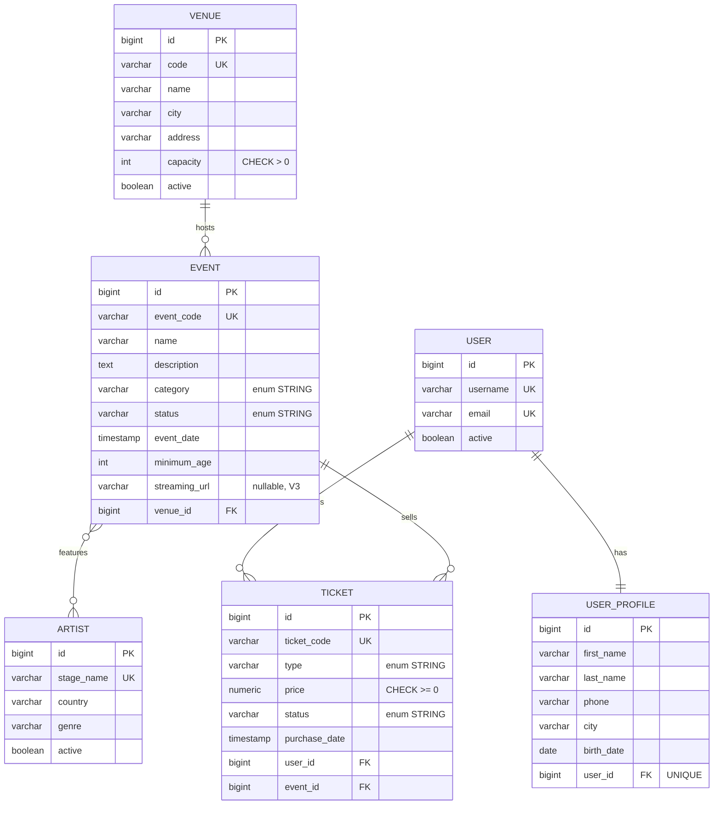

# PulsePass — Capa de persistencia (MVP académico)

Plataforma de **eventos, artistas y entradas**. Este repositorio implementa el núcleo de datos descrito en el PRD de PulsePass: modelo relacional en PostgreSQL, migraciones versionadas con Flyway, entidades JPA, repositories Spring Data y pruebas de integración contra PostgreSQL real con Testcontainers.


---

## Tabla de contenidos

1. [Stack tecnológico](#1-stack-tecnológico)
2. [Estructura del proyecto](#2-estructura-del-proyecto)
3. [Modelo de dominio](#3-modelo-de-dominio)
4. [Esquema relacional e integridad](#4-esquema-relacional-e-integridad)
5. [Migraciones Flyway](#5-migraciones-flyway)
6. [Consultas y repositories](#6-consultas-y-repositories)
7. [Ejecución de pruebas](#7-ejecución-de-pruebas)
8. [Ejecución local de la aplicación](#8-ejecución-local-de-la-aplicación)
9. [Decisiones de diseño](#9-decisiones-de-diseño)
10. [Trazabilidad con el PRD](#10-trazabilidad-con-el-prd)

---

## 1. Stack tecnológico

| Componente | Tecnología |
|---|---|
| Lenguaje | Java 21 |
| Framework | Spring Boot 4.1.1 (Spring Data JPA / Hibernate) |
| Base de datos | PostgreSQL |
| Migraciones | Flyway (`spring-boot-starter-flyway` + `flyway-database-postgresql`) |
| Pruebas | JUnit 5, AssertJ, Spring Boot Test, Testcontainers (PostgreSQL) |
| Build | Maven (wrapper incluido: `mvnw` / `mvnw.cmd`) |

Restricciones del caso académico que se respetan: no se usa H2, no se usa SQL nativo, no se usa Lombok, y `spring.jpa.hibernate.ddl-auto=validate` (Flyway es el único responsable del esquema).

---

## 2. Estructura del proyecto

```
PulsePass/
├── pom.xml
├── mvnw / mvnw.cmd
└── src/
    ├── main/
    │   ├── java/com/pulse/pass/
    │   │   ├── PulsePassApplication.java
    │   │   ├── domain/          # Entidades JPA y enums
    │   │   │   ├── Venue, Event, Artist, User, UserProfile, Ticket
    │   │   │   └── EventCategory, EventStatus, TicketType, TicketStatus
    │   │   └── repository/      # Interfaces Spring Data JPA
    │   │       ├── VenueRepository, EventRepository, ArtistRepository
    │   │       └── UserRepository, UserProfileRepository, TicketRepository
    │   └── resources/
    │       ├── application.yaml
    │       └── db/migration/    # V1, V2, V3 (Flyway)
    └── test/
        └── java/com/pulse/pass/
            ├── TestcontainersConfiguration.java
            ├── PulsePassApplicationTests.java
            └── repository/      # Pruebas de integración de repositories
```

---

## 3. Modelo de dominio



### Relaciones y su mapeo JPA

| Relación | Mapeo | Notas |
|---|---|---|
| Venue 1 : N Event | `Event.venue` `@ManyToOne(LAZY)` ↔ `Venue.events` `@OneToMany(mappedBy)` | `venue_id` es `NOT NULL` |
| Event N : M Artist | `Event.artists` (lado propietario, `@JoinTable event_artists`) ↔ `Artist.events` (`mappedBy`) | Tabla puente con PK compuesta |
| User 1 : 1 UserProfile | `UserProfile.user` (lado propietario, `unique = true`) ↔ `User.profile` (`mappedBy`) | La FK `user_id` es `UNIQUE` |
| User 1 : N Ticket | `Ticket.user` `@ManyToOne(LAZY, optional = false)` | |
| Event 1 : N Ticket | `Ticket.event` `@ManyToOne(LAZY, optional = false)` | |

### Enums

Todos se persisten con `@Enumerated(EnumType.STRING)` (nunca por ordinal) y además están protegidos por un `CHECK` en la base de datos.

| Enum | Valores |
|---|---|
| `EventCategory` | MUSIC, SPORTS, TECHNOLOGY, EDUCATION, CULTURE, ENTERTAINMENT |
| `EventStatus` | DRAFT, PUBLISHED, SOLD_OUT, CANCELLED, FINISHED |
| `TicketType` | GENERAL, VIP, BACKSTAGE, STUDENT |
| `TicketStatus` | RESERVED, PAID, CANCELLED, USED |

---

## 4. Esquema relacional e integridad

Siete tablas: `venues`, `events`, `artists`, `event_artists`, `users`, `user_profiles`, `tickets`.

| Campo / relación | Regla en PostgreSQL |
|---|---|
| `venues.code` | `UNIQUE NOT NULL` |
| `venues.capacity` | `CHECK (capacity > 0)` |
| `events.event_code` | `UNIQUE NOT NULL` |
| `events.category`, `events.status` | `CHECK (... IN (...))` con los valores del enum |
| `events.venue_id` | FK `NOT NULL` → `venues(id)` |
| `artists.stage_name` | `UNIQUE NOT NULL` |
| `users.username`, `users.email` | `UNIQUE NOT NULL` |
| `user_profiles.user_id` | FK + `UNIQUE` (garantiza 1:1) |
| `tickets.ticket_code` | `UNIQUE NOT NULL` |
| `tickets.price` | `NUMERIC(12,2)` + `CHECK (price >= 0)` |
| `tickets.type`, `tickets.status` | `CHECK (... IN (...))` con los valores del enum |
| `tickets.user_id`, `tickets.event_id` | FK `NOT NULL` |
| `event_artists` | `PRIMARY KEY (event_id, artist_id)` |

Índices creados en V1: `events(venue_id)`, `events(status, event_date)`, `event_artists(artist_id)`, `tickets(user_id)`, `tickets(event_id, status)`.

---

## 5. Migraciones Flyway

Ubicación: `src/main/resources/db/migration/`. Se aplican en orden sobre una base vacía.

| Migración | Objetivo |
|---|---|
| `V1__create_schema.sql` | Crea las 7 tablas con PK, FK, UNIQUE, CHECK e índices. |
| `V2__insert_initial.artists.sql` | Inserta el catálogo inicial: Solar Beat, Neon Waves, Caribbean Sound, Ocean Drive y Digital Pulse. |
| `V3__add_streaming_url_to_event.sql` | Agrega `streaming_url VARCHAR(500)` (nullable) a `events`, sin modificar V1. |

**Regla de oro:** una migración ya aplicada nunca se edita. Cualquier cambio estructural nuevo va en un `V4__...`, `V5__...`, etc. Editar V1 en un entorno compartido rompería la validación de checksums de Flyway.

---

## 6. Consultas y repositories

Todos los repositories extienden `JpaRepository`. Criterio aplicado: **Query Methods** para consultas simples y **JPQL con `@Query`** cuando hay `JOIN`, agregación o filtros combinados.

### `VenueRepository`
| Método | Tipo | Requisito |
|---|---|---|
| `findByCode(String code)` | Query Method | FR-VEN-001 |

### `EventRepository`
| Método | Tipo | Requisito |
|---|---|---|
| `findByEventCode(String eventCode)` | Query Method | FR-EVT-001 |
| `findByStatusOrderByEventDateAsc(EventStatus status)` | Query Method | FR-EVT-005 |
| `findByVenueCode(String venueCode)` | Query Method (navega `venue.code`) | FR-VEN-004 |
| `findByArtistStageName(String stageName)` | JPQL `JOIN e.artists` + `DISTINCT` | FR-ART-004, FR-SRC-001 |
| `findByCityAndArtist(String city, String stageName)` | JPQL (`e.venue.city` + `a.stageName`) | FR-SRC-002 |
| `findRecommendedEvents(LocalDateTime afterDate, String city, String artistName)` | JPQL: `PUBLISHED`, fecha posterior, ciudad, `LOWER(...) LIKE`, `DISTINCT`, `ORDER BY eventDate ASC` | FR-SRC-003 |

### `TicketRepository`
| Método | Tipo | Requisito |
|---|---|---|
| `findByTicketCode(String ticketCode)` | Query Method | FR-TKT-002 |
| `findByUserEmail(String email)` | Query Method (navega `user.email`) | FR-TKT-006 |
| `findByUserEmailAndStatus(String email, TicketStatus status)` | Query Method (navega `user.email`) | FR-TKT-006 |
| `findPaidTicketsByEventCode(String eventCode)` | JPQL | FR-TKT-007 |
| `countByEventCodeAndStatus(String eventCode, TicketStatus status)` | JPQL con `COUNT` | FR-TKT-008 |
| `findTicketsForEventsAfter(LocalDateTime date)`|	JPQL, navega t.event.eventDate, ordena ascendente |FR-SRC-004|

> **Por qué JPQL en `findPaidTicketsByEventCode`:** el estado `PAID` es un filtro fijo del caso de uso "consultar ventas", y expresarlo en JPQL deja la intención explícita sin necesidad de un nombre de método largo con navegación `Event.eventCode`.

### `UserRepository`, `UserProfileRepository`, `ArtistRepository`
| Método | Tipo | Requisito |
|---|---|---|
| `UserRepository.findByUsername(String)` | Query Method | FR-USR-001 |
| `UserRepository.findByEmailIgnoreCase(String)` | Query Method | FR-USR-001 |
| `UserProfileRepository.findByUser_Id(Long)` | Query Method | FR-USR-003/004 |
| `ArtistRepository.findByStageName(String)` | Query Method | FR-ART-001 |

---

## 7. Ejecución de pruebas

Las pruebas **no usan H2 ni una base instalada a mano**: cada ejecución levanta un contenedor PostgreSQL efímero con Testcontainers, Flyway construye el esquema desde cero, Hibernate lo valida (`ddl-auto=validate`) y luego se ejercitan los repositories.

**Requisito previo:** tener **Docker** en ejecución (Docker Desktop en Windows/macOS, o el daemon en Linux).

```bash
# Linux / macOS
./mvnw clean test
```

```powershell
# Windows (PowerShell)
.\mvnw.cmd clean test
```

Resultado esperado: `BUILD SUCCESS`. Los reportes quedan en `target/surefire-reports/`.

Para ejecutar una sola clase:

```bash
./mvnw test -Dtest=TicketRepositoryTest
```

### Pruebas existentes

| Clase | Qué verifica |
|---|---|
| `PulsePassApplicationTests` | El contexto arranca: Testcontainers + Flyway (V1–V3) + validación de Hibernate. |
| `EventRepositoryTest`(14 tests) | Venue (FR-VEN-001/002/003/004), Event (FR-EVT-001/002/005/006), Artist (FR-ART-001/002/003) y descubrimiento (FR-SRC-001/002/003). |
| `TicketRepositoryTest`(7 tests) | FK obligatorias (FR-TKT-001), ticketCode único (FR-TKT-002), precio no negativo (FR-TKT-003), consultas por usuario/estado (FR-TKT-006), tickets PAID por evento (FR-TKT-007), conteo por estado (FR-TKT-008) y tickets de eventos futuros (FR-SRC-004). |
| `UserProfileTest`(4 tests) | 	Registro de usuario y perfil (FR-USR-001/004), username/email únicos (FR-USR-002), segundo perfil para el mismo usuario rechazado — 1:1 (FR-USR-003).|

Resultado verificado: las 26 pruebas (1 + 14 + 7 + 4) están registradas en target/surefire-reports/ con Failures: 0, Errors: 0, confirmando BUILD SUCCESS end-to-end (QT-010).

Las pruebas usan `@SpringBootTest` + `@Transactional` (rollback automático) y `saveAndFlush` para forzar que las violaciones de constraints salgan de PostgreSQL.

---

## 8. Ejecución local de la aplicación

La aplicación toma la conexión de variables de entorno, con estos valores por defecto (`application.yaml`):

| Variable | Valor por defecto |
|---|---|
| `DB_URL` | `jdbc:postgresql://localhost:5432/pulsepass` |
| `DB_USER` | `postgres` |
| `DB_PASSWORD` | `postgres` |

**Opción A — PostgreSQL con Docker:**

```bash
docker run --name pulsepass-db -e POSTGRES_DB=pulsepass \
  -e POSTGRES_USER=postgres -e POSTGRES_PASSWORD=postgres \
  -p 5432:5432 -d postgres:16

./mvnw spring-boot:run
```

Flyway aplicará V1, V2 y V3 automáticamente al iniciar.

**Opción B — con Testcontainers (sin instalar nada):**

```bash
./mvnw spring-boot:test-run
```

Usa `TestPulsePassApplication`, que levanta la app con un PostgreSQL efímero.

---

## 9. Decisiones de diseño

- **`Ticket` es una entidad, no un `@ManyToMany` User–Event**, porque tiene datos propios: `ticketCode`, `type`, `price`, `status` y `purchaseDate` (BR-006).
- **Dinero con `BigDecimal` / `NUMERIC(12,2)`**, nunca `float`/`double` (BR-007, NFR-008).
- **Enums por nombre** (`EnumType.STRING`) más `CHECK` en la base de datos (BR-008).
- **La integridad vive en PostgreSQL**: `UNIQUE`, `CHECK` y FK `NOT NULL`, no solo en anotaciones Java (NFR-001).
- **`SOLD_OUT` no se calcula**: se persiste manualmente; la comparación capacidad-vs-tickets `PAID` queda para una futura capa de servicio (BR-010).
- **Relaciones `LAZY`** en los `@ManyToOne` y `open-in-view: false` para evitar cargas implícitas fuera de transacción.
- **Sin Lombok**: las entidades usan getters/setters explícitos (evita `@Data` sobre entidades JPA).

---
## 10. Trazabilidad con el PRD

| Requisito | Dominio | Repository | Prueba |
|---|---|---|---|
| FR-VEN-* | `Venue` | `VenueRepository`, `EventRepository` | `EventRepositoryTest` |
| FR-EVT-* | `Event` + `Venue` | `EventRepository` | `EventRepositoryTest` |
| FR-ART-* | `Event` + `Artist` | `EventRepository`, `ArtistRepository` | `EventRepositoryTest` |
| FR-USR-* | `User` + `UserProfile` | `UserRepository`, `UserProfileRepository` | `UserProfileTest` |
| FR-TKT-* | `Ticket` + `User` + `Event` | `TicketRepository` | `TicketRepositoryTest` |
| FR-SRC-* | `Event` / `Artist` / `Venue` | `EventRepository`, `TicketRepository` | `EventRepositoryTest`, `TicketRepositoryTest` |
| NFR-002/003 | Flyway | — | `PulsePassApplicationTests` (implícita) |
| NFR-004/005 | Testcontainers | — | Todas las pruebas de integración |


---

## Licencia

Proyecto académico — caso de estudio de capa de persistencia.
